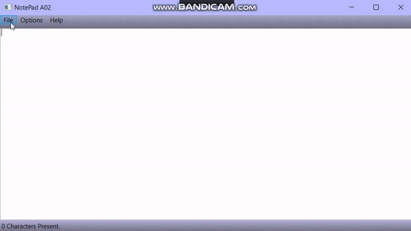

<!-- PROJECT LOGO -->
 

<h3 align="center">C# Text Editor</h3>

  

    Text editor built in C# using WPF
     
     
     
  

<!-- TABLE OF CONTENTS -->

  
Table of Contents

  <ol>
    <li>
      <a href="#about-the-project">About The Project</a>
      <ul>
        <li><a href="#built-with">Built With</a></li>
      </ul>
    </li>
    <li>
      <a href="#getting-started">Getting Started</a>
    </li>
    <li><a href="#usage">Usage</a></li>
    <li><a href="#contact">Contact</a></li>
    <li><a href="#acknowledgments">Acknowledgments</a></li>
  </ol>

<!-- ABOUT THE PROJECT -->
## About The Project

[![Product Name Screen Shot][product-screenshot]](./img/Capture.jpg)

This project is a text editor built in WPF using C#. It contains a live character counter in the bottom left hand corner that changes whenever a character is added or removed. It supports reading and writing text files. The user may open a text file they already have, modify the contents, and save the file as a new text file or overwrite the original. The user may also create a new file in the program
and save it. The program will prompt the user to save changes upon exit if changes have not been saved.

(<a href="#readme-top">back to top</a>)

### Built With

* [![Windows Presentation Foundation][WPF]][WPF-url]
* [![CSharp][C-sharp]][Csharp-url]

(<a href="#readme-top">back to top</a>)

<!-- GETTING STARTED -->
## Getting Started

To setup this program all you will need is visual studio and support for C# and WPF. 

(<a href="#readme-top">back to top</a>)

<!-- USAGE EXAMPLES -->
## Usage

This program supports the editing of text files. The user may create a new file from scratch just by typing, save their current work as a new file or overwrite an older file, open text files to read and write, clear the working area, and save opened files.

 

Example of user typing into blank working area, with live character count in corner, and clearing working area after confirming the prompt.

 

Example of user opening a text file, with character counter updating to show the files character count, along with editing of the file and overwriting the same file.

(<a href="#readme-top">back to top</a>)

<!-- CONTACT -->
## Contact

Briana Burton - [in/briana-burton/](https://www.linkedin.com/in/briana-burton/) - brianareburton@gmail.com

Project Link: [https://github.com/bburton0334/csharp_text_editor](https://github.com/bburton0334/csharp_text_editor)

(<a href="#readme-top">back to top</a>)

<!-- ACKNOWLEDGMENTS -->
## Acknowledgments

* I am not responsible for someone maliciously copying this source code with the intent of submitting it as their own for an assignment.

(<a href="#readme-top">back to top</a>)

<!-- MARKDOWN LINKS & IMAGES -->
[product-screenshot]: img/Capture.jpg
[WPF]: https://img.shields.io/badge/wpf-000000?style=for-the-badge&logo=xaml&logoColor=white
[WPF-url]: https://visualstudio.microsoft.com/vs/features/wpf/
[C-sharp]: https://img.shields.io/badge/C%23-000000?style=for-the-badge&logo=csharp&logoColor=white
[Csharp-url]: https://docs.microsoft.com/en-us/dotnet/csharp/

